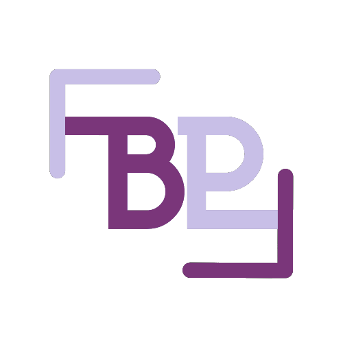

Download BPFramework file and put it under your ServerScriptService

By forbrad

Join my discord: https://discord.gg/2B3vBzqnhT
Youtube Introduction Tutorial: https://www.youtube.com/watch?v=3Df70TJZunI
Youtube Util/PlayerLoaded threading (V1.1): https://www.youtube.com/watch?v=6YmqBxVvfsI
# Roblox BP Framework

This is a simple roblox framework for people who just wanna use a well made framework in roblox studio


# Documentation

Server - Server Modules
Client - Client Modules
Start()
Init()

# Server Networking

```
Server.Post:Client(event,player, ...)
```
Example:
```lua
--Server
local player = game.Players.forbrad --ANY PLAYER
Server.Post:Client("TestEvent", player, "TESTCLIENT")

--Client 
Client.Listen:Connect("TestEvent",function(arg)
    print(arg)
end)

--Output arg: TESTCLIENT
```
# Client Networking
```
Client.Post:Server(event, ...)
```
Example:
```lua
--Client
Client.Post:Server("TestEvent","TESTSERVER")

--Server
Server.Listen:Connect("TestEvent", function(player, arg) 
   print(player.Name, arg)
end)

--Output player, arg: forbrad TESTSERVER
```
# All Network functions

```lua
--Client
Client.Post:Server(event, ...)
Client.Listen:Connect(event, func) [func put function in here]

--Server
Server.Post:Client(event,player, ...)
Server.Post:AllClients(event, ...)
Server.Post:AllClientsExcept(event,player, ...) --[player or {list of players}]
Server.Post:ClientList(event,playerList, ...) --[{list of players}]

Server.Listen:Connect(event, func) --[func put function in here]
```
#  Util/PlayerLoaded threading

Youtube Util/PlayerLoaded threading (V1.1): https://www.youtube.com/watch?v=6YmqBxVvfsI

```lua

self.Main:CreateGrid(StartPosition,GridPart, TInstance, Rows,Cells, Gap) --creates a grid
self.Main:CameraInRange(targPos,Range, func() ) -- func = function() end) return function if camera in range

--PlayerLoaded Util/Threads
self.Main:SetPlayerLoaded() -- Tells the server and the local client that the player is loaded
self.Main:OnPlayerLoaded(func(player))--func = function() end) return function if a player in the game has been loaded
self.Main:PlayerLoadedWait(player) --Yields task.wait for player to be loaded

--Character/Player Threads 
self.Main:OnCharacterTouched(func(char,part))-- func = function() end) return function if a in the workspace character has been touched

--Common util functions

self.Main:ChanceListGet(chances) -- returns a random value in a table
-- EX: chance = {{"Test1", 30},{"Test2", 25},{"Test3", 25},{"Test4", 20}} returns random string from weights

self.Main:FaceVector(part, position) -- Faces part towards the positon
self.Main:TweenFoward(part,Time, amount, TweenType ) -- Tweens the part by amount studs in Time seconds EX: workspace.Part, 3, 50, Enum.EasingStyle.Linear
self.Main:WeldModel(model) -- Welds model to its primary part
self.Main:AllOfC(ChildName, parent, func(child)) -- return function of every child in parent named ChildName
self.Main:AllOfD(ChildName, parent, func(child)) -- return function of every descendant in parent named ChildName


```
